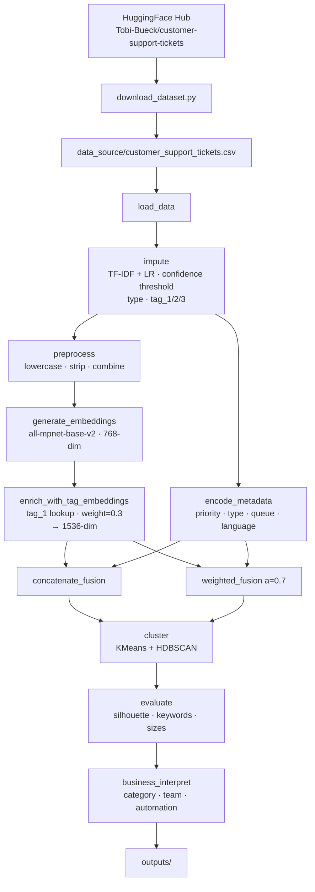

# Ticket Clustering Pipeline

Production-grade NLP pipeline that clusters IT support tickets by semantic meaning
and operational metadata, simulating ITSM issue categorization, routing, and failure
pattern detection.

---

## Executive Summary

### Dataset

**Source:** `Tobi-Bueck/customer-support-tickets` via HuggingFace Hub — 61,765 rows, 16 columns.

**Critical structural finding — two merged sources:**

| | Labeled segment | Unlabeled segment |
|---|---|---|
| Rows | 48,587 (78.7%) | 13,178 (21.3%) |
| Language | 58% EN / 42% DE | 100% DE |
| Queues | ITSM (Technical Support, IT Support, Billing…) | Consumer verticals (Arts, Food, Pets, News…) |
| Priority levels | low / medium / high | low / medium / high / critical / very_low |
| `type` | Incident / Request / Problem / Change | All null — structurally absent |
| `tag_1` | Fully present | All null — structurally absent |

Other key findings:
- `subject`: 8.6% null — entirely within the labeled segment; body is always present
- `queue`: 52 unique values, zero nulls, zero overlap between segments
- Priority: balanced across labeled segment (max share 37.8%) — no skew bias risk
- Body text: median 57 words, max 281 — no 512-token truncation concern
- `tag_1` through `tag_3` are hierarchical IT labels on labeled rows; `tag_6`–`tag_8` near-empty (<10%)
- `version` (53.7% null) and `answer` (agent reply) excluded from the pipeline

---

### Preprocessing Transformations

**1. Imputation** (`pipeline/impute.py`)

TF-IDF (15k features, bigrams, log-TF) + Logistic Regression trained on labeled rows,
with per-column confidence thresholding. One vectorizer is fit once and reused across
all columns.

| Column | Threshold | Imputed | Below threshold |
|---|---|---|---|
| `type` | 0.70 | 3,832 rows | 9,346 → `'Unknown'` |
| `tag_1` | 0.65 | ~3 rows | 13,175 → `'Unknown'` |
| `tag_2` | 0.70 | 0 rows | 13,237 → `'Unknown'` |
| `tag_3` | 0.75 | ~3 rows | 13,406 → `'Unknown'` |

Tag imputation is near-zero by design — the confidence thresholding correctly rejects
predictions for consumer-domain tickets that have no IT vocabulary overlap with the
training set (CV F1-macro: tag_1=0.44, tag_2=0.24, tag_3=0.16; 0% confidence on
unlabeled rows at any threshold).

**2. Text cleaning** (`pipeline/preprocessing.py`)
- Null subjects become empty string; text = `subject + " " + body`
- Lowercase → strip non-alphanumeric except digits → collapse whitespace
- Domain keyword allowlist preserved: VPN, DNS, SSO, MFA, 2FA, API, SSL, TLS, LDAP, OAuth, SLA
- Minimal cleaning by design — sentence transformers perform best on natural language

---

### Feature Selection

**Semantic features** (`pipeline/embeddings.py`)

`all-mpnet-base-v2` sentence embeddings on combined `subject + body` → (n, 768), cached to disk.

Enriched with `tag_1` embeddings: 211 unique real tag values embedded once and looked
up per row. Concatenated to text embeddings scaled by `weight=0.3`. Rows with no real
tag (`Unknown`) receive a zero vector — tag contributes nothing for those rows.
Final semantic vector: **(n, 1536)**.

**Operational features** (`pipeline/operational_features.py`)

| Feature | Encoding | Rationale |
|---|---|---|
| `priority` | Ordinal (very_low=0 … critical=4) | Ranking is meaningful |
| `type` | One-hot (5 columns incl. Unknown) | No natural ordering |
| `queue` | Frequency encoding (1 column) | 52 values — one-hot would be sparse |
| `language` | One-hot (2 columns: en / de) | Binary, no ordering |

All features min-max normalized to [0, 1] before fusion.

---

### Clustering Method

**4 total runs** — 2 fusion strategies × 2 clustering algorithms.

**Fusion strategies:**

| Strategy | How |
|---|---|
| Concatenation | `[semantic_vecs \| operational_vecs]` — equal weight |
| Weighted | `alpha=0.7 * semantic + 0.3 * operational` — semantic-dominant |

**Clustering algorithms:**

- **KMeans** — k=8, k-means++ init, n_init=10, random_state=42. Assumes spherical clusters, deterministic.
- **HDBSCAN** — min_cluster_size=308 (~0.5% of 61k rows), min_samples=5, euclidean. Density-based, labels noise as -1.

**Evaluation:** silhouette score, TF-IDF post-hoc keyword extraction (top 10 per cluster),
business interpretation mapping clusters to ITSM routing categories (Identity & Access,
Network Ops, Desktop Support, etc.).

---

## Architecture



---

## Quick Start

```bash
pip install -r requirements.txt
python download_dataset.py   # fetch from HuggingFace and save CSV
python run_pipeline.py       # results in outputs/
```

---

## Design Decisions

### Why Sentence Embeddings Over TF-IDF
TF-IDF represents text as a sparse bag of overlapping words. Two tickets like
"can't connect to VPN" and "VPN connection failing" share almost no tokens after
normalization and appear dissimilar. `all-mpnet-base-v2` encodes semantic meaning --
both map to nearby 768-dimensional vectors. This is critical for ITSM data where
users describe the same problem in dozens of different ways.

**Trade-off:** ~2min CPU inference vs <1s for TF-IDF. Mitigated by disk caching.

### Why tag_1 Embeddings Instead of One-Hot
One-hot encoding 211 unique tag values creates 211 sparse binary columns with no
semantic relationship between them. Embeddings place "Security" near "Network" and
"Virus", and "Billing" near "Payment" — the geometric relationships carry real signal
for clustering. Zero vectors for `Unknown` rows mean untagged tickets contribute no
tag signal and are carried entirely by their text and operational features.

### Why KMeans + HDBSCAN
**KMeans** is the baseline: interpretable, fast, deterministic (given `random_state`).
Assumes spherical, equally-sized clusters. Fails when real-world cluster sizes differ
dramatically (password resets >> VPN configs).

**HDBSCAN** handles arbitrary cluster shapes and sizes, and labels genuine outliers as
noise (-1) rather than forcing them into the nearest cluster. Better reflects real
ITSM distributions. Non-deterministic — results may vary between runs.

### Why Two Fusion Strategies
- **Concatenation:** equal signal weight. Best when both signals matter equally.
- **Weighted (a=0.7):** tunable. Best when you have domain knowledge about signal importance.


### Why Confidence-Thresholded Imputation
Simple null-filling (mode, 'Unknown' sentinel) ignores the information already present
in the text. A trained classifier recovers type labels for 3,832 previously unlabeled
rows at ≥70% confidence. Rows below threshold receive `'Unknown'` rather than a
low-confidence guess, preserving data integrity. The `type_imputed` flag column
lets downstream analysis distinguish original from machine-filled labels.

---

## Hyperparameter Analysis

See `notebooks/hyperparameter_analysis.ipynb` for full visual analysis. Key parameters:

| Parameter | Value | Rationale |
|---|---|---|
| Embedding model | all-mpnet-base-v2 | Best STS benchmark score, acceptable CPU speed |
| Tag enrichment weight | 0.3 | Tag signal at 30% of text magnitude — enriches without dominating |
| KMeans k | 8 | Start range 4–12 based on 4 ticket types and 52 queues |
| HDBSCAN min_cluster_size | 308 | ~0.5% of 61k rows; lower than 1% to allow tighter clusters |
| Fusion alpha | 0.7 | Semantic-dominant; operational adds routing context |
| Imputation threshold | 0.7 | Balances recall (3,832 imputed) vs precision (no low-confidence fills) |

---

## Observations

> Fill in after running the pipeline and inspecting `outputs/evaluation_summary.json`
> and `notebooks/cluster_interpretation.ipynb`.

---

## Limitations

- **Hyperparameter sensitivity:** KMeans results change with k; HDBSCAN with min_cluster_size.
  No single configuration is universally optimal.
- **Embedding truncation:** `all-mpnet-base-v2` truncates at 512 tokens. Long ticket
  descriptions lose their tail — acceptable for this dataset (max 281 words, well within limit).
- **Business interpretation heuristic:** Routing rules are keyword-based, not trained.
  A production system would use a trained classifier on labeled clusters.
- **Bilingual corpus:** Domain keyword allowlist is English-only. German-language tickets
  may have weaker keyword preservation during cleaning.
- **Tag imputation gap:** 13,178 consumer-segment tickets cannot be tag-imputed (domain
  gap too wide). They cluster as a structurally distinct group, which is correct behaviour
  but means ITSM-specific clusters are drawn from the 48,587 labeled rows primarily.

---

## Scaling to Production

**Large datasets (>1M tickets):**
- Batch embedding with `sentence-transformers` `encode()` in chunks
- Approximate nearest neighbor (FAISS, ScaNN) instead of exact KMeans
- HDBSCAN can be replaced with its approximate variant

**Real-time routing:**
- Embed new ticket → cosine similarity search against cluster centroids
- Vector database (Pinecone, Weaviate, pgvector) for sub-millisecond lookup

**Batch vs real-time:**
- Batch: nightly re-clustering to capture drift in ticket distributions
- Real-time: embed + nearest-centroid lookup, no re-clustering
